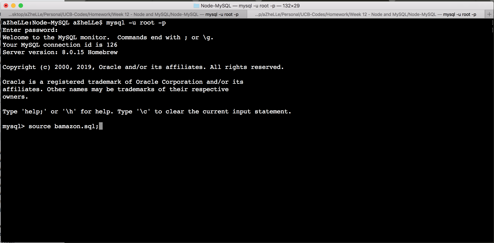
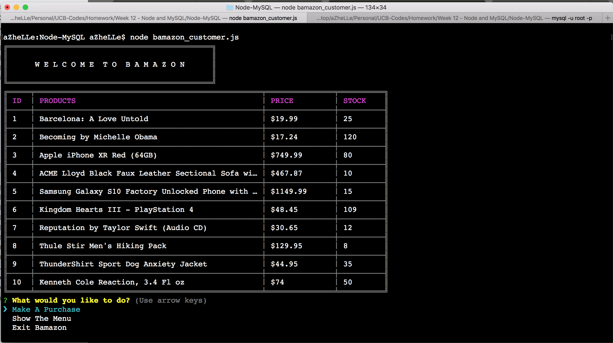
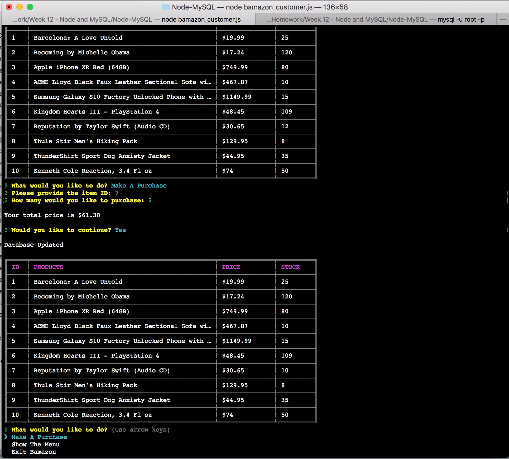
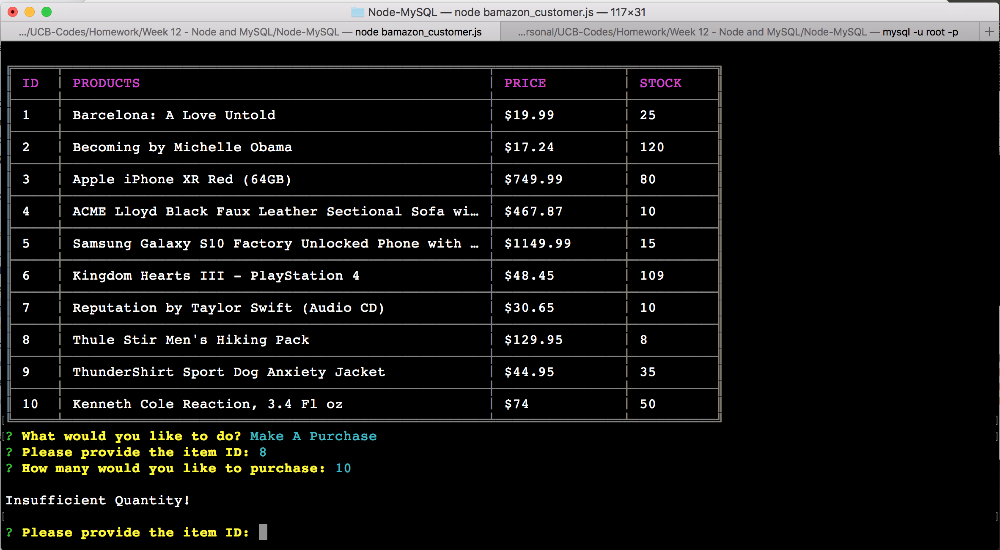

# BAMAZON - Challenge #1

### Description

Bamazon will be a command line node app that behaves like the Amazon Store. It will allow the user to make purchase. Each valid purchases will update the database and will prompt user insufficient quantity if stock left does not meet the required number of purchases.

### How It Works

1. Run the following commands to install the packages:

	- npm init -y
	- npm i inquirer
	- npm i cli-table
	- npm i mysql
	- npm i require

2. Run The SQL provided in the code

3. Once your database has been established, you can now run the application with the following command:

	node bamazon_customer.js
	

	The app has three commands available:

		a. Make A Purchase
		b. Show The Menu
		c. Exit Bamazon

### Packages Used

Inquirer - https://www.npmjs.com/package/inquirer (used for the prompts)

CLI-Table - https://www.npmjs.com/package/cli-table (used to properly display the table)

MySQL - https://www.npmjs.com/package/mysql (used for the database)

Require - https://www.npmjs.com/package/require (used to import packages in the javascript file)

### Screenshots

1. Showing The Main Menu

2. Making A Purchase (With Enough Stock)

3. Making A Purchase (With Insufficient Stock)

